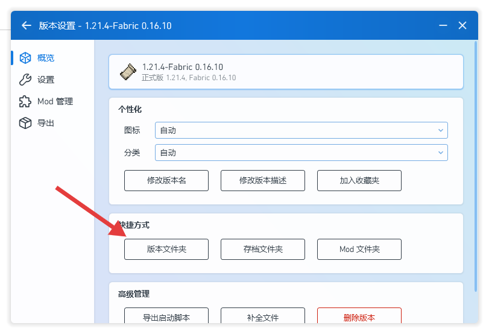
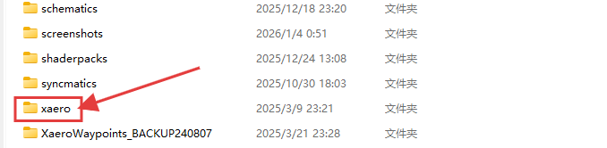
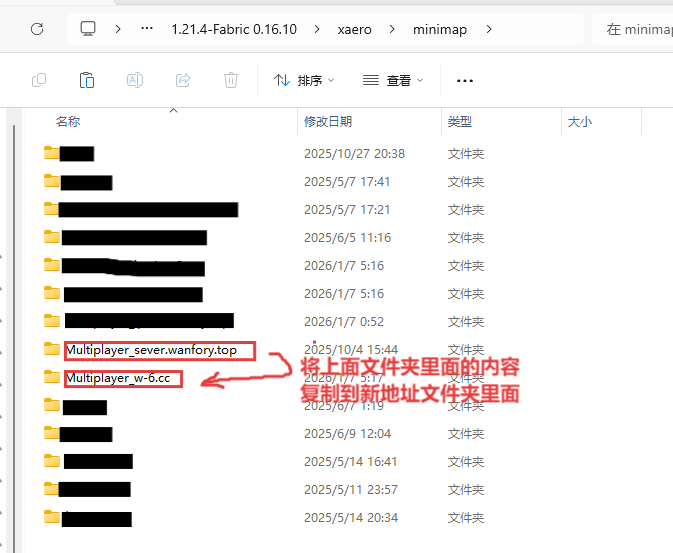

# 服务器改变地址后地图数据迁移教程
:::caution
此方法仅是服务器更换地址，如果服务器更换地图不适用
:::
当 Minecraft 服务器地址变更时，你可能希望保留之前已探索的地图数据与路径点。本教程将指导你如何迁移 Xaero 地图模组中的路径点与地图数据。

---

## 第一步：打开游戏版本文件夹

1. 打开你的 Minecraft 启动器（如 PCL、HMCL 或其他启动器）。
2. 在启动器界面中找到你当前游玩的游戏版本，进入该版本的设置界面。
3. 点击 **“版本文件夹”** 或类似选项，打开该版本的游戏目录。

>   
> *图示：在启动器中找到版本文件夹入口*

---

## 第二步：找到 Xaero 地图数据文件夹

在版本文件夹中，寻找名为 **`xaero`** 的文件夹并打开。该文件夹存储了 Xaero 地图模组的所有数据。

>   
> *图示：在游戏目录中找到 xaero 文件夹*

---

## 第三步：迁移地图数据

### 1. 路径点数据迁移

- 进入 `xaero` 文件夹后，打开 **`minimap`** 文件夹。
- 你会看到以服务器地址命名的文件夹（例如 `Multiplayer_服务器地址` 或者 `Multiplayer_111.222.333.444:25565`）。
- 将 **旧服务器地址文件夹** 复制并替换到 **新服务器地址文件夹** 。

>   
> *图示：复制旧服务器路径点文件至新服务器文件夹*

### 2. 地图数据迁移

- 返回 `xaero` 文件夹，打开 **`worldmap`** 文件夹。
- 同样地，将旧服务器地址文件夹内的所有文件，复制并替换到新服务器地址对应的文件夹中。

>   
> *图示：复制旧服务器地图文件至新服务器文件夹*

---

## 注意事项

- 建议在操作前备份整个 `xaero` 文件夹，以防数据丢失。
- 完成迁移后，重启 Minecraft 并进入新服务器，即可看到之前保存的路径点与地图数据。

---

> 如果你使用的是其他地图模组（如 JourneyMap），迁移方法可能不同，请参考对应模组的文档。
